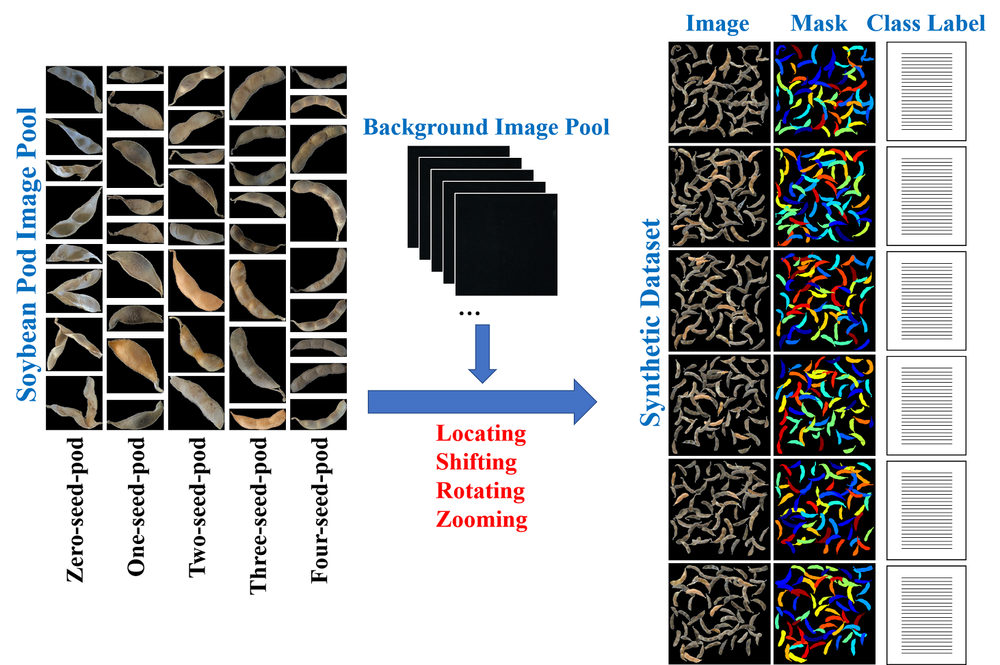
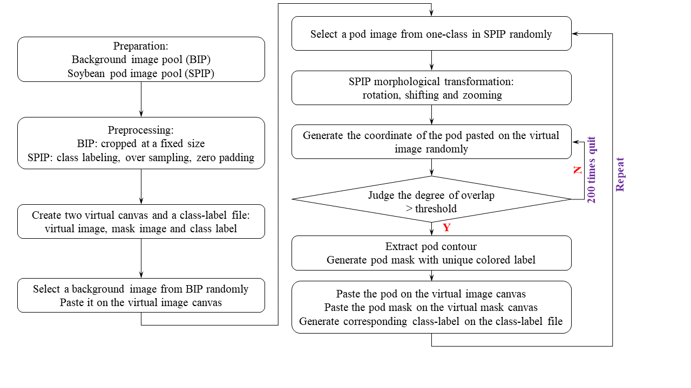
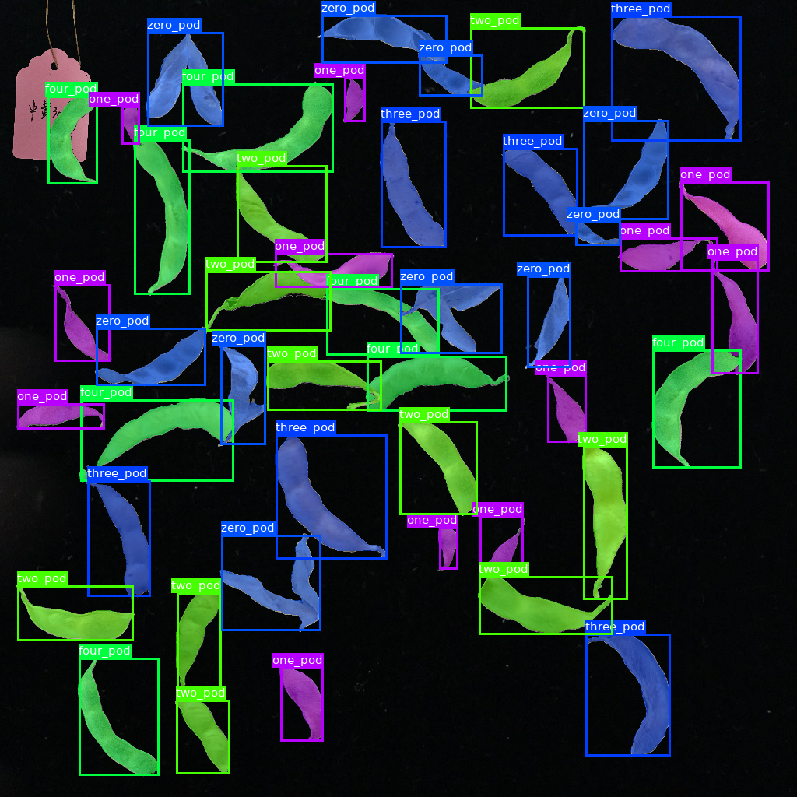

# Code for paper "RefinePod: towards high throughput soybean pods high-quality segmentation and seed-per-pod estimation for plant breeding"

# Data
All the image set is provided in Googledrive.
[https://drive.google.com/drive/folders/1pf2BnLCkVOvAByKOHUzaVqcC7ucgSpdH?usp=sharing](https://drive.google.com/drive/folders/1pf2BnLCkVOvAByKOHUzaVqcC7ucgSpdH?usp=sharing)

# Overview

<strong>Figure.1: The flow chart of synthesizing fine-labeled multi-class soybean pods images</strong>

<strong>Figure.2: The detail of the synthesizing fine-labeled multi-class soybean pods images dataset including simulated soybean pod image, corresponding mask image and homologous class-label file</strong>

# Results

<strong>Figure.3: The synthetic high throughput fine-labeled multi-class pods image example </strong>

# Implementation
This repository will provide the code for the paper -- <strong>Coming Soon</strong>.

# Cite
The relative paper should be cited when you use our code or dataset.

# Reference
[Toda Y, Okura F, Ito J, et al. Training instance segmentation neural network with synthetic datasets for crop seed phenotyping](https://www.nature.com/articles/s42003-020-0905-5)

[Dwibedi D, Misra I, Hebert M. Cut, paste and learn: Surprisingly easy synthesis for instance detection](https://openaccess.thecvf.com/content_iccv_2017/html/Dwibedi_Cut_Paste_and_ICCV_2017_paper.html)

